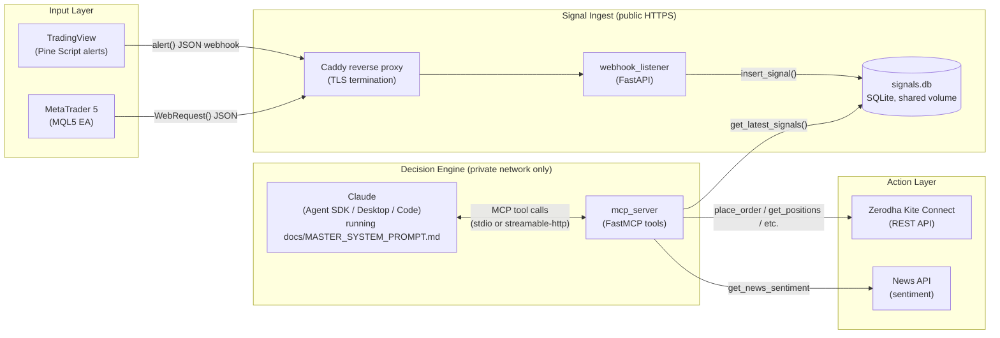

# Architecture & Data Flow

## Component overview

## Why this shape

**The webhook listener is the only public surface.** TradingView and MT5
can only speak outbound HTTP(S) to a URL you give them -- they cannot pull
data via MCP themselves. So a small FastAPI service accepts their alerts,
validates a shared secret, and writes to SQLite. Everything downstream of
that reads from the DB, so the public attack surface is one endpoint with
one secret check, not the broker-connected process.

**The MCP server never faces the public internet.** It holds Kite API
credentials and can place real orders, so in `docker-compose.yml` it's
bound to `127.0.0.1` only. You reach it from wherever Claude is running via
an SSH tunnel or private VPN -- never a public port.

**Claude is the brain, tools are the hands.** Claude doesn't compute
position sizing or talk to Kite directly; it calls deterministic tools
(`risk.py`, `broker_kite.py`) that enforce hard numeric limits in code.
This means a bad LLM decision can be *out-voted* by code (a rejected order,
a blocked risk gate) rather than relying entirely on prompt discipline.

**Paper mode is the default.** `LIVE_TRADING_ENABLED=false` until you
explicitly flip it, at every layer: the env var gates every order-placing
tool call regardless of what Claude decides.

## Request/response lifecycle (one decision cycle)

1. A Pine Script alert or MT5 EA fires on a bar close and POSTs JSON to
   `webhook_listener`, which validates the secret and stores a `signals`
   row.
2. On its own schedule (interactive session, or a cron-triggered check-in
   -- see `docs/DEPLOYMENT.md`), Claude runs the standing workflow from
   `docs/MASTER_SYSTEM_PROMPT.md`: pull account state, run the risk gate,
   read new signals, corroborate with price/news tools, size the trade,
   decide, and (if every gate passes) execute.
3. Every tool call and its result is visible in the conversation transcript
   -- that transcript *is* your audit log. Persist it (Claude Code session
   logs, or pipe Agent SDK transcripts to disk) so every trade is
   traceable back to the signal and reasoning that produced it.

## Extending to another broker

`broker_kite.py` exposes broker-agnostic tool names
(`get_positions`, `place_order`, `place_gtt_order`, ...). To add Groww,
Hyperliquid, or a generic REST broker, write a sibling module
(`broker_groww.py`) implementing the same tool names against that broker's
SDK/REST API, register it in `server.py` instead of (or alongside)
`broker_kite`, and the system prompt and risk-gate tools need no changes.
